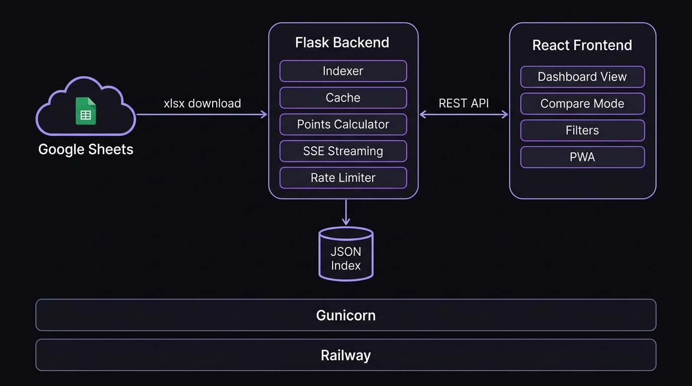

<div align="center">

# 🛡️ NS Duty Dashboard

**A high-performance, real-time duty tracking and compensation calculator for military personnel.**

Built with Flask · React · Vite · Google Sheets Integration · Progressive Web App

[](https://python.org)
[](https://flask.palletsprojects.com)
[](https://react.dev)
[](https://vitejs.dev)
[](#)

[Live Demo](https://ns-duty-dashboard.onrender.com) · [Features](#-features) · [Architecture](#-architecture) · [Getting Started](#-getting-started) · [Deployment](#-deployment)

</div>

---

## 📋 Overview

The **NS Duty Dashboard** transforms a complex military duty roster Excel workbook (updated via Google Sheets) into an interactive, searchable web dashboard. Personnel can instantly look up their consolidated duty history, track compensation points, compare duties with peers, and export reports — all from a single premium-grade dark-themed interface.

### The Problem

Military duty rosters are managed in sprawling Excel workbooks with separate sheets for each month. To find out how many duties a person has done, someone would need to manually search through dozens of sheets, count rows, cross-reference dates, and calculate compensation points by hand.

### The Solution

This dashboard **automates everything**:
- Downloads the latest roster from Google Sheets automatically
- Builds an optimized JSON index of all duties across all months
- Provides instant lookups, filtering, sorting, and side-by-side comparison
- Calculates duty points and off-day entitlements in real-time
- Works offline as an installable Progressive Web App

---

## ✨ Features

### Core Dashboard

| Feature | Description |
|---------|-------------|
| 🔍 **Personnel Lookup** | Dropdown with all personnel names auto-extracted from the workbook. Recent searches saved as quick-access pills. |
| 📅 **Date Range Selector** | Pick any start/end month range with client-side validation. |
| 📊 **Live Stats Cards** | Real-time summary showing Total Duties, Guard, BDS, Weekdays, Fridays, and Weekends with percentage breakdowns. |
| 📋 **Interactive Duty Table** | Full duty history with columns for Date, Day, Category, Type, Entry Details, Points, and Source Reference. |
| 🔎 **Multi-Filter System** | Filter by search keyword, month, day category (Weekday/Friday/Weekend), and duty type (Guard/BDS) — all instant, no re-fetch. |
| ↕️ **Sort Toggle** | Toggle between oldest-first and newest-first ordering. |
| 📥 **CSV Export** | One-click download of the complete filtered duty report as a `.csv` file with all columns including points. |
| 🔗 **Deep Linking** | URL query parameters (`?name=...&start=...&end=...`) allow direct sharing of specific reports. |
| 🌓 **Dark/Light Theme** | Seamless theme toggle persisted to localStorage. |
| 🔔 **Toast Notifications** | Success and error feedback for all user actions. |

---

### 🏆 Duty Points Calculator

Automatically calculates compensation points based on the official points matrix:

| Duty Type | Day | Points per Duty |
|-----------|-----|:-:|
| **Guard** | Monday – Friday | 0.20 |
| **Guard** | Saturday | 0.40 |
| **Guard** | Sunday | 0.30 |
| **BDS** | Monday – Friday | 0.00 |
| **BDS** | Saturday | 0.25 |
| **BDS** | Sunday | 0.25 |

> **Conversion:** 5 points = 1 off-day

**Simplified View** — Two big stat cards (Total Points / Off Days Earned) with an animated progress bar showing how close you are to the next off-day.

**Detailed View** — Full breakdown table showing Duty Type × Day Category × Count × Rate × Subtotal with grand totals and estimated offs.

---

### 👥 Multi-User Comparison

Select two personnel and see their duty fairness side-by-side:

- **Stat Cards** — Every metric compared with colored diff badges (`+5` green, `-3` red, `=` neutral)
- **Points Comparison** — Total points and off-days earned per person in big highlighted cards
- **Merged Timeline** — All duties from both personnel interleaved chronologically, color-coded by person (purple for Person A, blue for Person B)

---

### ⚡ Performance & Reliability

| Feature | What It Does |
|---------|-------------|
| 📡 **SSE Live Streaming** | Real-time progress updates during data refresh via Server-Sent Events — no polling. |
| ⏱️ **Rate Limiting** | 3-minute cooldown on manual refresh to prevent Google Sheets API abuse. |
| 🗜️ **Gzip Compression** | All HTTP responses compressed via Flask-Compress, reducing payload sizes by ~70%. |
| 🧹 **Startup Cleanup** | Automatically removes stale lock files and temp files from crashed workers on boot. |
| 📱 **Offline PWA** | Service worker caches the app shell and last API responses. Works offline after first visit. Installable on mobile/desktop. |

---

## 🏗️ Architecture



```
┌──────────────────┐     HTTPS      ┌──────────────────────────────────────┐
│  Google Sheets   │ ──────────────▶│          Flask Backend               │
│  (Live Roster)   │    .xlsx       │                                      │
└──────────────────┘  download      │  ┌─────────────┐  ┌──────────────┐  │
                                    │  │  Downloader  │  │   Indexer    │  │
                                    │  │  (urllib)    │──│  (openpyxl)  │  │
                                    │  └─────────────┘  └──────┬───────┘  │
                                    │                          │          │
                                    │                    ┌─────▼──────┐   │
                                    │                    │  JSON Index │   │
                                    │                    │ (in-memory) │   │
                                    │                    └─────┬──────┘   │
                                    │                          │          │
                                    │  ┌───────────┐  ┌───────▼───────┐  │
                                    │  │  Points   │  │  Duty Payload │  │
                                    │  │ Calculator│◀─│    Builder    │  │
                                    │  └───────────┘  └───────────────┘  │
                                    │                                      │
                                    │  SSE Stream · Rate Limiter · Gzip   │
                                    └──────────────┬───────────────────────┘
                                                   │ REST API
                                                   │ + Static Files
                                    ┌──────────────▼───────────────────────┐
                                    │         React Frontend (SPA)         │
                                    │                                      │
                                    │  Dashboard · Compare · Points · PWA  │
                                    │  Filters · CSV Export · Theme Toggle │
                                    └──────────────────────────────────────┘
```

### Data Flow

1. **Google Sheets** → Backend downloads the Excel workbook via public export URL
2. **openpyxl** scans every monthly sheet, extracting duty entries by regex-matching rank/name/duty patterns
3. Results are compiled into an **optimized JSON index** (`_duty_index.json`) with fingerprinting to skip unnecessary rebuilds
4. The index is held **in-memory** behind a thread-safe `DutyDataStore` with `RLock` for concurrent reads
5. **Frontend** fetches data via REST endpoints and renders everything client-side with React

### Tech Stack

| Layer | Technology | Version |
|-------|-----------|---------|
| **Runtime** | Python | 3.12 |
| **Backend** | Flask + Flask-CORS + Flask-Compress | 3.1 |
| **Excel Parsing** | openpyxl | 3.1.5 |
| **Frontend** | React + Vite | 19 / 8 |
| **Icons** | Lucide React | 1.17 |
| **WSGI Server** | Gunicorn (gthread) | 23.0 |
| **Deployment** | Railway | — |

---

## 📁 Project Structure

```
Optimised-Duty-Dashboard-App/
├── server.py               # Flask backend (1,238 lines) — API, indexer, points, SSE
├── foe_duty_reporter.py    # Legacy CLI duty reporter (kept for reference)
├── requirements.txt        # Python dependencies
├── gunicorn.conf.py        # Production WSGI configuration
├── render.yaml             # Render deployment spec
├── Procfile                # Heroku/Railway process definition
├── FOE 2026.xlsx           # Local fallback Excel workbook
│
└── dashboard/              # React frontend
    ├── index.html          # SPA entry point with PWA meta tags
    ├── package.json        # Node dependencies
    ├── vite.config.js      # Vite config with API proxy
    ├── public/
    │   ├── sw.js           # Service worker (offline caching)
    │   ├── manifest.json   # PWA manifest
    │   └── favicon.svg     # App icon
    └── src/
        ├── main.jsx        # React mount + SW registration
        ├── App.jsx         # All components (1,296 lines)
        └── index.css       # Full design system (1,325 lines)
```

**Total codebase:** ~3,900 lines across 4 core files.

---

## 🚀 Getting Started

### Prerequisites

- **Python** ≥ 3.10
- **Node.js** ≥ 20
- **npm** ≥ 10

### Installation

```bash
# Clone the repository
git clone https://github.com/MicroKryptx/ns-duty-dashboard.git
cd ns-duty-dashboard

# Install Python dependencies
pip install -r requirements.txt

# Install and build the frontend
cd dashboard
npm ci --include=dev
npm run build
cd ..
```

### Running Locally

```bash
# Start the Flask server (serves both API and frontend)
python server.py
```

Open [http://localhost:5000](http://localhost:5000) in your browser.

### Development Mode

For hot-reloading during frontend development:

```bash
# Terminal 1: Start Flask backend
python server.py

# Terminal 2: Start Vite dev server (proxies API to Flask)
cd dashboard
npm run dev
```

Open [http://localhost:5173](http://localhost:5173) for the Vite dev server.

---

## ⚙️ Configuration

All configuration is done via environment variables with sensible defaults:

| Variable | Default | Description |
|----------|---------|-------------|
| `PORT` | `5000` | HTTP port |
| `GOOGLE_SHEET_ID` | *(set)* | Google Sheet ID for the roster |
| `CACHE_TTL_SECONDS` | `3600` | How long before cached data is considered stale |
| `REFRESH_COOLDOWN_SECONDS` | `180` | Minimum wait between manual refreshes |
| `DOWNLOAD_TIMEOUT_SECONDS` | `12` | HTTP timeout for Google Sheets download |
| `STARTUP_BACKGROUND_REFRESH` | `true` | Auto-fetch from Google Sheets on boot |
| `WEB_CONCURRENCY` | `1` | Gunicorn worker count |
| `GUNICORN_THREADS` | `4` | Threads per worker |

---

## 🌐 Deployment

### Railway (Recommended)

The repository is configured for seamless deployment on **Railway**:

1. Push your repository to GitHub
2. Create a new service on [Railway](https://railway.app) and select your GitHub repository
3. Railway automatically detects the `Procfile` and root `package.json` build script

**Build Command:** `pip install -r requirements.txt && cd dashboard && npm ci --include=dev && npm run build`

**Start Command:** `gunicorn server:app --config gunicorn.conf.py --bind 0.0.0.0:$PORT`

### Render / Heroku / Other Platforms

The included `render.yaml` and `Procfile` allow instant deployment on Render, Heroku, or any platform supporting WSGI:

```
web: gunicorn server:app --config gunicorn.conf.py --bind 0.0.0.0:$PORT
```

### Memory Optimization

The app is tuned for **512MB RAM** free-tier instances:
- Single Gunicorn worker with 4 threads (`gthread` mode)
- In-memory JSON index instead of per-request Excel parsing
- Atomic file writes to prevent corruption
- Startup cleanup of stale lock/temp files

---

## 🔌 API Reference

| Method | Endpoint | Description |
|--------|----------|-------------|
| `GET` | `/api/bootstrap` | Initial data: personnel names, months, readiness status |
| `GET` | `/api/names` | List of all personnel names |
| `GET` | `/api/months` | Available month range |
| `POST` | `/api/duties` | Duty report for a person over a date range |
| `POST` | `/api/compare` | Side-by-side comparison of 2 personnel |
| `POST` | `/api/validate` | Check if a person exists in a date range |
| `POST` | `/api/refresh` | Trigger data refresh from Google Sheets |
| `GET` | `/api/refresh/stream` | SSE stream of refresh progress |
| `GET` | `/api/status` | Current data freshness and refresh state |
| `GET` | `/api/healthz` | Health check (always `200`) |
| `GET` | `/api/readyz` | Readiness check (data loaded?) |

---

## 🛠️ How It Was Built

This project evolved through several iterations:

### Phase 1: CLI Reporter
Started as a Python CLI script (`foe_duty_reporter.py`) that parsed the Excel workbook and generated JSON/text reports. Required manual execution and produced static files.

### Phase 2: Web Dashboard
Added a Flask backend (`server.py`) serving a React frontend. Initial version re-parsed the Excel file on every API request — slow and memory-intensive.

### Phase 3: Optimized Architecture
Refactored to an **index-based architecture**:
- Parse the workbook once → build a JSON index → serve from memory
- Background thread downloads from Google Sheets without blocking requests
- Thread-safe `DutyDataStore` with `RLock` for concurrent access
- Atomic file writes prevent corruption during crashes

### Phase 4: Feature Enhancements
Added 7 major improvements:
1. **Duty Points Calculator** — Fair compensation tracking with simplified/detailed views
2. **SSE Progress Streaming** — Real-time refresh progress replacing wasteful polling
3. **Gzip Compression** — ~70% smaller HTTP responses
4. **Startup File Cleanup** — Automatic recovery from crashed worker states
5. **Refresh Rate Limiting** — 3-minute cooldown preventing API abuse
6. **Offline PWA Support** — Service worker for installable offline-capable app
7. **Multi-User Comparison** — Side-by-side duty fairness analysis

---

## 📄 License

This project is privately maintained. All rights reserved.

---

<div align="center">

**Built with ❤️ for fair duty tracking**

*React · Flask · Vite · Google Sheets · PWA*

</div>
